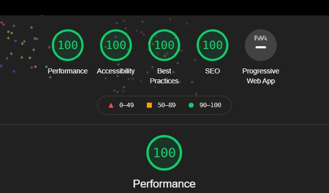

<h1 align="center">
Self-Hosting Google Fonts in Next.js with Taiwind CSS
</h1>

---

## Table of Contents

- [Table of Contents](#table-of-contents)
- [Introduction](#introduction)
- [Hosting Google Fonts is Free?](#hosting-google-fonts-is-free)
- [Setup](#setup)
  - [Resource Folder structure](#resource-folder-structure)
  - [Font Loading](#font-loading)
  - [Optimising for no FOUT or FOIT](#optimising-for-no-fout-or-foit)
    - [Font Display Swap](#font-display-swap)
  - [Preloading Crticial Resources](#preloading-crticial-resources)
  - [Tailwind Configuration](#tailwind-configuration)
  - [The Fonts CSS Fle](#the-fonts-css-fle)
  - [Tailwind base CSS](#tailwind-base-css)
    - [Tailwind config file](#tailwind-config-file)
- [Lighthouse Score](#lighthouse-score)
- [Reasons for self-hosting](#reasons-for-self-hosting)
- [Next](#next)
- [Further reading](#further-reading)
  - [Tools](#tools)
  - [Npm packages](#npm-packages)

## Introduction

**Typography can make your applications :sparkles: zing :sparkles:!!!**

Adding Google Fonts allow you to use _custom fonts_ on your apps.
They are advertised as free and there are over 900+ font families to choose from. Since 2018, Google has recommended self-hosting as a way to add their fonts.

There are number of _web safe_ fonts, that are free and built into various platforms. However, sometimes we need something that is more customised, to serve our design purposes.

So "without much further-a-do"...

This `repo` specifically targets the self-hosting of Google Fonts, rather than using a link to their CDN, and how to integrate them into a Next.js app that uses Tailwind CSS.

There are number of pros and cons for self-hosting, which have been discussed in many articles and blogs, I wont be detailing this here. I have provided a few links at the end of this readme file, for further reading.

## Hosting Google Fonts is Free?

Google Fonts are advertised as Open Source and free to use...
But Don't take my word for it, (I'm no laywer and this is not legal advice)

All fonts used in this example are sourced from Google Fonts under the SIL Open Font License (OFL) V1.1. I have taken care to incorporate the licenses into the self-hosting folders within the repo, which is requested in the OFL.

Note: you should always read the font license information yourself since you're responsible for following it. At this time Google Fonts use OFL v1.1, some use the Apache 2 license. The Ubuntu fonts use the Ubuntu Font License v1.0

You should seek legal advice before self-hosting or using any Custom Fonts.

## Setup

You can get hold of Google Fonts in a number of ways, (this is not an exhausitive list), using the following tools:

- Google Fonts Browser
- Google Fonts Helper

Fonts can also be found on Googles Github Repo.

Once, you have downloaded them you can add them to your project to self-host.

### Resource Folder structure

The easiest way to host them is under a `public` folder, in a sub folder named `fonts`.

> I've structured the font resource locations as follows, you dont have to follow this, it demonstrates flexibility and that all fonts can be organised rather than just being placed under the `fonts` sub folder.

```code
 ├── public
 |   └── fonts
 |       └── google
 │           ├── font(s) by name
 │           │      │   ├── .woff / .ttf (etc)
 │           │      │   ├── .css
 │           │      │   ├── licence.txt
 ├── styles
 |   └── global.css (app-base.css)
 ├── .gitignore
 ├── jsconfig.json
 ├── postcss.config.js
 ├── tailwind.config.js

```

The fonts will be serverd from this location to our Bext.js app.

### Font Loading

Once we have downloaded the files and licenses and structured the folders, we need to perform font loading.

We can use ***@font-face*** to load the fonts. See the .css files placed alongside the font resources in the `font` folder above.

We can eventually import these into the Tailwind styles CSS file. Normally this is called `global.css`, I'm using 3 files which are imported into the Next.js _app.js file.

For example:

```css
@font-face {
    font-family: 'Oswald Variable';  /*Ive added a prefix to let me know its a variable font*/
    font-style: normal;
    font-weight: 200 700;
    src: local('Oswald'),
        url(/fonts/google/oswald/Oswald-VariableFont_wght.ttf) format('truetype');
    font-display: swap; 
}
```

### Optimising for no FOUT or FOIT

I've dones some small optimisations for the font(s) loading using the `font-display` attribute. 

- FOUT (Flash of Unstyled Text).
- FOIT (Flash of Invisible Text).

By using `@font-face` in combination with `font-display` attributes we can prevent FOUT and FOIT.

There are a number of strategies available to implement this:

| Strategy | Description |
|---| ---|
|1. `block` | dont render anything to the use until the fonts loaded. |
|2. `swap` | recommended for google fonts. Typically, not much flashing since Google CDN quite fast. |
|3. `fallback` | not recommended. It still shows invisible text like block for a short time, but will eventually fallback to a safe font |
|4. `optional` | a good choice when font is not important, more focus on brand and content. Is like slow connected fallback that might not even load a font. |

#### Font Display Swap

This is a new rule you can add to your font-face declaration that tells the browser to use the fallback system safe-fonts you have listed (e.g. Sans Serif), then swap to the desired font when it has been downloaded.

Its a good performance improvement as it displays content without waiting fopr downloads to finish.

`font-display: swap;` does have the drawback of flashing this unstyled text if the font has yet to load. But we can remedy that with Preload.

### Preloading Crticial Resources

We can [preload](https://web.dev/preload-critical-assets/) our fonts in the `<head>` of our page app. This is especially useful for those critical bits of typography that we want to display without flashing.

Tod this I added `<preload>` to the head of my page, we can do this by adding it into the custom document file for Next.js: `_document.js`:

```html
        <Head>
          <link
            rel="preload"
            href="/fonts/google/grandstander/Grandstander-VariableFont_wght.ttf"
            as="font"
            type="font/ttf"
            crossOrigin="anonymous"
          />
```

Its recommended to be careful when using Preload, as it can have a negative effect, if overused. So we use it wisely.  Its a way of setting the importance of a resource, we can also do the same for our `script` resources if needs be.

### Tailwind Configuration

### The Fonts CSS Fle

Next I create a `Fonts.css` file under the `public\fonts` folder. This is where I import the various CCS files for the Google Font resources loaded using `@font-face` above, i.e.

```css

@import './google/grandstander/Grandstander-Variable.css';

```

This is then imported into the tailwind style file below.

### Tailwind base CSS

Next we add the following to the `app-base.css` file under the `./styles` folder.

We use the `@layer` directive to tell Tailwind which "bucket" we adding the font styles too.
Valid layers are a base, components, and utilities.

```code
@layer base {
    @import "../public/fonts/fonts.css";
  }
```

We then import the styles to the _app.js file

```code
import '@/styles/app-base.css';
import '@/styles/app-components.css';
import '@/styles/app-utilities.css';
```

#### Tailwind config file

Finally, we set up the `tailwind.config.js` file to add the font familes to our app.
We either add them to the base font themes or extend the themes (or both).

For example:

```code
const { fontFamily } = require('tailwindcss/defaultTheme');

module.exports = {
    fontFamily: {
      sans: ['Oswald Variable, Arial', fontFamily.serif],
      serif: ['Merriweather Sans, Georgia', fontFamily.serif],
    },
    extend: {
      fontFamily: {
        'Grandstander-VariableFont': ['Grandstander Variable'],
      },
    },
      },
;
```

---

## Lighthouse Score

Remember you can use lighthouse to test the performance of your page, this will all look for Font and Scripts optimsations and include recommendations, including FOUT and FOIT issues.

Once build I'm pleased to say this demo gets the following when running locally.



## Reasons for self-hosting

The main reasons I choose to self host, are as follows:

|||
|---| ---|
|1. **Google Recommends it** | Its now recommended by Google themselves. Since 2018, Google has recommended self hosting, for optimal peformance through preloading. Self-hosting is free and is encouraged, see this video [Google Chrome Developers: Web Performance made easy](https://youtu.be/Mv-l3-tJgGk). |
|2. **better for privacy** | 3rd party CDNs can use cookies and tracking algorithms you dont neccessarily know about. This can be a problem in countries where you need user consent, (i.e. Data Privacy and GDPR, see:  [GDPR-compliance of Google Fonts](https://complianz.io/google-fonts-and-gdpr-does-it-work/). |
|3. **better for security** | more control on your own server).  You actually call at least 2 domains when using the CDN.|
|4. **faster and more peformant**| Google Fonts add resources that you may not need. You can choose font styles, etc and bundle and minify your own font-related CSS rules/files, giving fewer http requests. You can do this by ownly serving the specific fonts and unicodes you need for your sites typography. Specifiying parts of font familes rather than whole families. You can choose font styles, etc and bundle and minify your own font-related CSS rules/files, giving fewer http requests.|
|5.**offline availability**| for mobile and desktop apps that are accessed offline. |

---

## Next

- Try this out for yourself.

- I would encourage you to test with your specific site/app and use the dev tools combined with "disable cache" and the built-in ability to change connection speeds.

- I have not covered the use of `npm packages` to add fonts. There are a number of flavours available online if this is your preference.
- Some alternatives are to try using _Fontsource_, or _next-google-fonts_.

---

## Further reading

- [WP Speed Matters : Why you should Self-Host Google Fonts in 2021](https://wpspeedmatters.com/self-host-google-fonts/)
- [evatototuts+ : How to Self-Host Google Fonts on Your Own Server](https://webdesign.tutsplus.com/tutorials/how-to-self-host-google-fonts--cms-34775)
- [Using @font-face](https://css-tricks.com/snippets/css/using-font-face/)

### Tools

- [Google Fonts Browser](https://fonts.google.com/)
- [Google Fonts Repo](https://github.com/google/fonts)

### Npm packages

- [Fontsource](https://fontsource.org/) | [GitHub: Fontsource](https://github.com/fontsource/fontsource) | [Self-host Google Fonts in your next React project with Fontsource](https://dev.to/danwalsh/self-host-google-fonts-in-your-next-react-project-with-fontsource-1n07)
- [GitHub: Google Font Metadata](https://github.com/fontsource/google-font-metadata)
- [GitHub: next-google-fonts](https://github.com/joe-bell/next-google-fonts)
